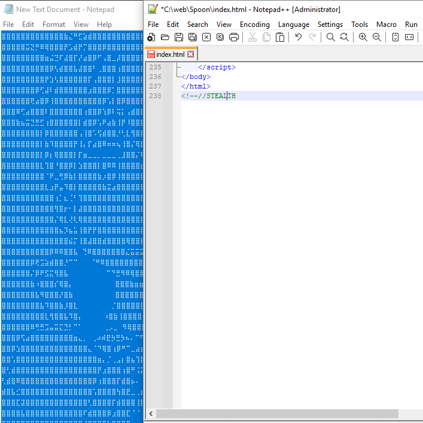

<div> 

</br>

  **`selamat pagi`**
</div>

## おれは「**[kido](https://ko-fi.com/weirdo_kido)**」だ。
</br>
<div align="center">

[](https://developer.mozilla.org/en-US/docs/Glossary/HTML5) </br>
</div>

<details>
</br>

[](https://pcsupport.lenovo.com/id/id/products/laptops-and-netbooks/100-series/110-14ast/solutions/pd104490-product-overview-ideapad-110-14ast-110-15ast) [](https://www.samsung.com/id/support/model/SM-A207FZRDXID/) [](https://notepad-plus-plus.org/) [](https://acode.app/)
[](https://play.google.com/store/apps/details?id=jp.ne.ibis.ibispaintx.app)

  ```bash
<div align="center"> [](https://developer.mozilla.org/en-US/docs/Glossary/HTML5) </br> </div> <details> </br> [](https://pcsupport.lenovo.com/id/id/products/laptops-and-netbooks/100-series/110-14ast/solutions/pd104490-product-overview-ideapad-110-14ast-110-15ast) [](https://www.samsung.com/id/support/model/SM-A207FZRDXID/) [](https://notepad-plus-plus.org/) [](https://acode.app/) [](https://play.google.com/store/apps/details?id=jp.ne.ibis.ibispaintx.app)
  ```
</details> </br>
<div align="center">
  
[](https://github.com/weirdo-kido/Spoon/discussions)
</div>
